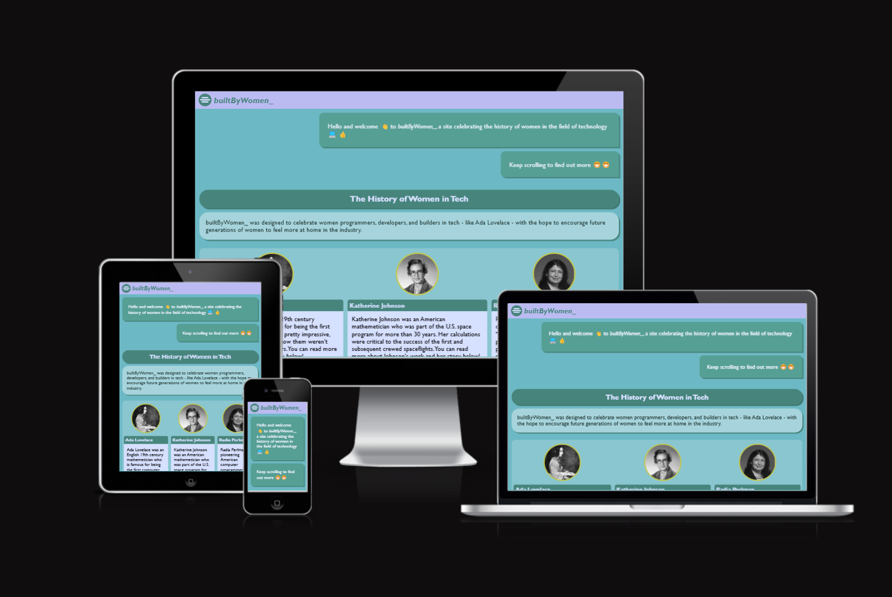
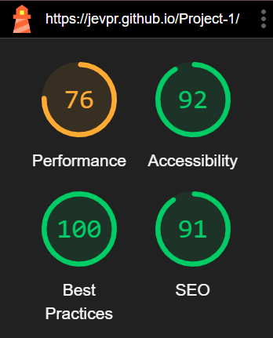

# Bootcamp Project 1: <i>builtByWomen\_</i>

Website Url: [https://jevpr.github.io/Project-1/](https://jevpr.github.io/Project-1/)

## Table of Contents

1. [Project Outline](#project-outline)

- [Purpose](#purpose)

2. [Design](#design)

- [Name](#name)
- [Colour Palette](#colour-palette)
- [Balsamiq Wireframes](#balsamiq-wireframes)

3. [Finished Project](#finished-project)

- [Responsive](#responsivity)
- [Browser Friendly](#browser-friendly)

## Project Outline

### Purpose:

The purpose of this project was to create an informative, easy-to-use website that detailed the history of women in technology.

I wanted the site to look professional, be clear and informative, but also be fun to use.

### Audience

My target audience was younger users, ideally girls 8 years +. As a result:

- The site needed an <em>accessible style</em> that would be appropriate for younger users. I took inspiration from the [BBC Bitesize website](https://www.bbc.co.uk/bitesize/topics/zx24xg8/articles/zprj7ty#zhrkjfr) layouts and [CGP Revision books](https://www.theworks.co.uk/dw/image/v2/BDXF_PRD/on/demandware.static/-/Sites-master-catalog-tws-uk/default/dwb3e29f89/9781782945598_1_Z.jpg?sw=400&sh=400&sm=fit).
- Content on the page needed to be kept <em>short</em>, to keep younger audiences engaged.
- Layout and formatting needed to be <em>fun and playful</em>.

<br>
<br>

## Design

### Name

The initial working name for the site was 'womenInTech\_', but this always had to change because that site already exists. I wanted a name which emphasized the roles women played as founders and innovaters. So rather than 'women <b>in</b> tech,' I chose 'built <b>by</b> women'.

### Colour Palette

When considering color palette, I wanted to choose something that had a feminine feel to it. I wanted something a bit playful, that wasn't overly corporate. However, I wanted to avoid stereotypically 'feminine' colors like pink.

So, I chose the following color palette using the [coolors.co](https://coolors.co/) website.


> To do: COLOR PALETTE ACCESSIBILITY

### Balsamiq Wireframes

The following picture shows my initial mobile-first website design:


### Features of the Final Design

## Finished Project

### Responsive

The website is fully responsive for phones, tablets, laptops and desktops. Here, I have tested out the site's responsivity via <em>Am I responsive?</em> website:



For tests, I used [Am I Responsive?](https://ui.dev/amiresponsive?url=https://jevpr.github.io/Project-1/).

### Browser Friendly

The site has been tested for the following browsers: Chrome, Firefox, Safari, Edge, Vivaldi, Brave, and Tor Browser.

For tests, I used [Browserling.com](https://www.browserling.com/browse/win10/safari5.1.5/https://jevpr.github.io/Project-1/).

### Accessibility

I checked accessibility by running my site through the Lighthouse tool on Google Dev tools.



### GiHub and Deployment

This website was linked with GitHub by <em>initalizing a respository</em> via Visual Studio Code. This created a new responsitory on my GitHub, where I could commit and sync changes I made on my local computer.

During this process, I had to type some commands into the console:

```
git init -b main

git config --global user.name "your-github-name"

git config --global user.email "your-email"
```

I deployed the website using GitHub's in built deployment featured, accessed through Settings > Pages for my Project 1 Respository.
